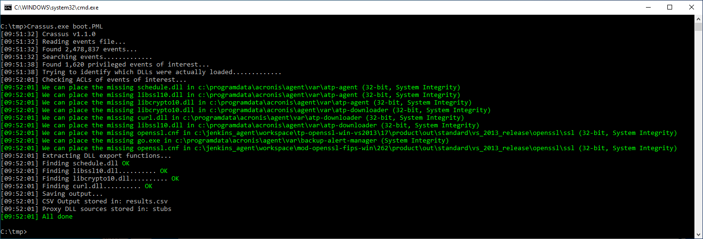
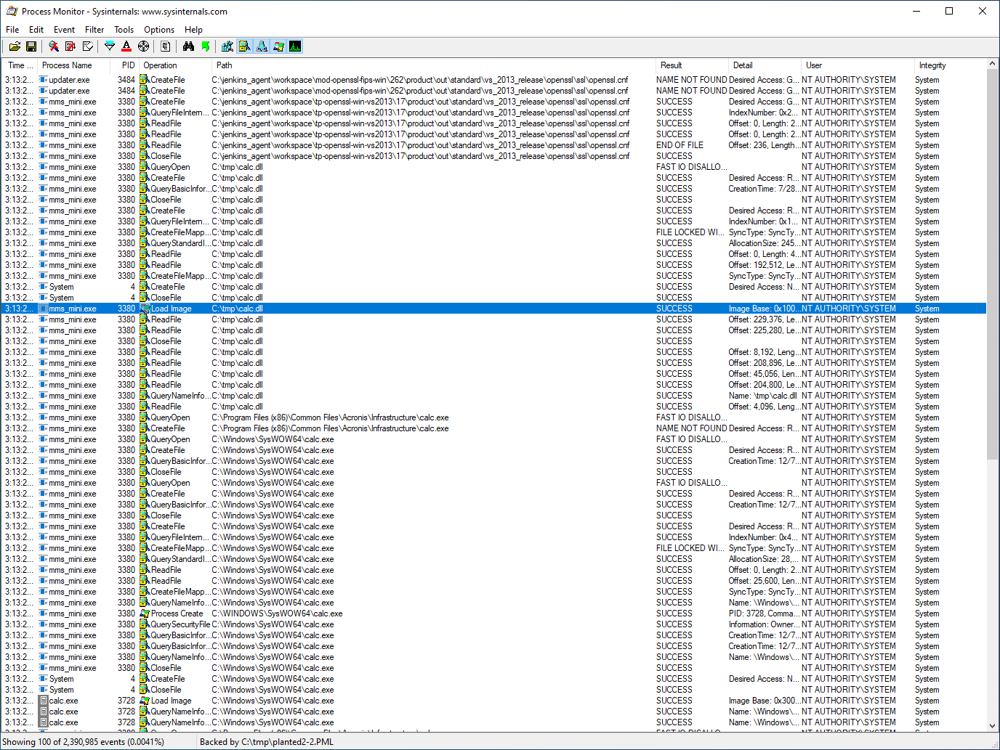
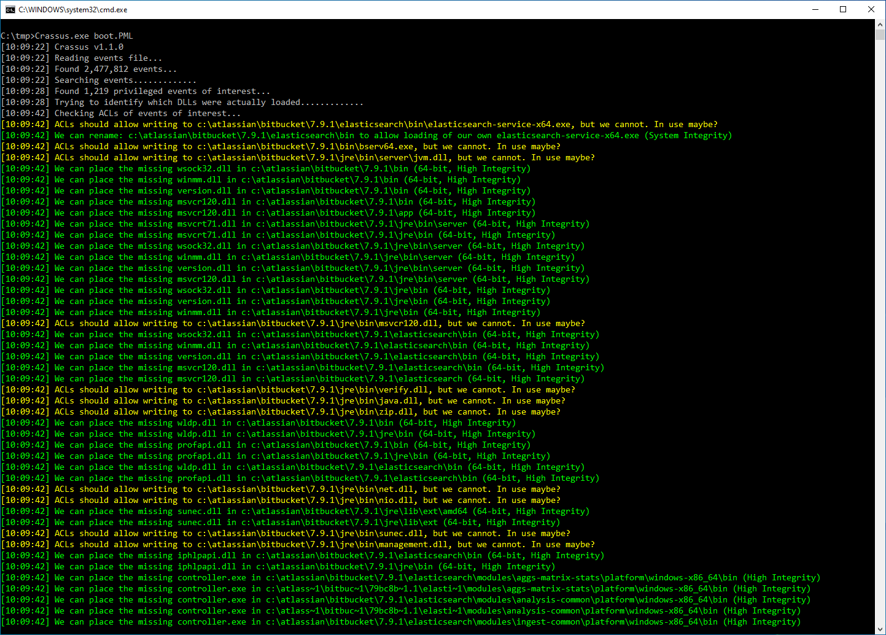

# Crassus Windows privilege escalation

## Why "Crassus"?

Accenture made a tool called [Spartacus](https://github.com/Accenture/Spartacus), which finds DLL hijacking opportunities on Windows. Using Spartacus as a starting point, we created Crassus to extend Windows privilege escalation finding capabilities beyond simply looking for missing files. The ACLs used by files and directories of privileged processes can find more than just [looking for missing files](https://vuls.cert.org/confluence/display/Wiki/2021/06/21/Finding+Privilege+Escalation+Vulnerabilities+in+Windows+using+Process+Monitor) to achieve the goal.

## Did you really make yet another privilege escalation discovery tool?

...but with a twist as Crassus is utilizing the [SysInternals Process Monitor](https://learn.microsoft.com/en-us/sysinternals/downloads/procmon) and is parsing raw PML log files. Typical usage is to generate a boot log using Process Monitor and then parse it with Crassus. It will also automatically generate source code for proxy DLLs with all relevant exports for vulnerable DLLs.

## Features

* Parsing ProcMon PML files natively. The log (PML) parser has been implemented by porting partial functionality to C# from https://github.com/eronnen/procmon-parser/. You can find the format specification [here](https://github.com/eronnen/procmon-parser/tree/master/docs).
* Crassus will create source code for proxy DLLs for all missing DLLs that were identified. For instance, if an application is vulnerable to DLL Hijacking via `version.dll`, Crassus will create a `version.cpp` file for you with all the exports included in it. Then you can insert your payload/execution technique and compile.
* For other events of interest, such as creating a process or loading a library, the ability for unprivileged users to modify the file or any parts of the path to the file is investigated.
* Able to process large PML files and store all events of interest in an output CSV file. Local benchmark processed a 3GB file with 8 million events in 45 seconds.

# Table of Contents

* [Screenshots](#screenshots)
    * [Crassus Execution](#Crassus-execution)
    * [CSV Output](#csv-output)
    * [Exports](#output-exports)
    * [Export DLL Functions](#export-dll-functions)
* [Usage](#usage)
    * [Execution Flow](#execution-flow)
    * [Command Line Arguments](#command-line-arguments)
    * [Examples](#examples)
    * [Proxy DLL Template](#proxy-dll-template)
    * [openssl.cnf Template](#openssl-template)
* [Compiling Proxy DLLs](#compiling-proxy-dlls)
    * [Visual Studio](#visual-studio)
    * [MinGW](#mingw)
* [Real World Examples](#real-world-examples)
    * [Acronis True Image](#acronis-true-image)
    * [Atlassian Bitbucket](#atlassian-bitbucket)
* [Contributions](#contributions)
* [Credits](#credits)

# Screenshots

## Crassus Execution


## CSV Output


## Output Exports


## Export DLL Functions


# Usage

## Execution Flow

1. In [Process Monitor](https://learn.microsoft.com/en-us/sysinternals/downloads/procmon), select the `Enable Boot Logging` option. 

2. Reboot.
3. Once you have logged in and Windows has settled, run Process Monitor once again.
4. When prompted, save the boot log.
5. Reset the default Process Monitor filter using `Ctrl-R`.
6. Save this log file, e.g., to `boot.PML`. The reason for re-saving the log file is twofold:
    1. Older versions of Process Monitor do not save boot logs as a single file.
    2. Boot logs by default will be unfiltered, which may contain extra noise, such as a local-user DLL hijacking in the launching of of Process Monitor itself.

## Command Line Arguments

| Argument                  | Description |
| ------------------------- | ----------- |
| `--pml`                   | Location (file) of the existing ProcMon event log file.|
| `--verbose`               | Enable verbose output. |
| `--debug`                 | Enable debug output. |

## Examples

Collect all events and save them into `C:\tmp\boot.PML`. All vulnerable DLLs will be saved as `C:\tmp\results.csv` and all proxy DLL source files in `C:\tmp\stubs`.

```
C:\tmp> Crassus.exe boot.PML
```


## Proxy DLL Template

Below is the template that is used when generating proxy DLLs, the generated `#pragma` statements are inserted by replacing the `%_PRAGMA_COMMENTS_%` string.

The only thing to be aware of is that the `pragma` DLL will be using a hardcoded path of its location rather than trying to load it dynamically.

```cpp
#pragma once

%_PRAGMA_COMMENTS_%

#include <windows.h>
#include <string>

VOID Payload() {
    // Run your payload here.
    WinExec("calc.exe", 1);
}

BOOL WINAPI DllMain(HINSTANCE hinstDLL, DWORD fdwReason, LPVOID lpReserved)
{
    switch (fdwReason)
    {
    case DLL_PROCESS_ATTACH:
        Payload();
        break;
    case DLL_THREAD_ATTACH:
        break;
    case DLL_THREAD_DETACH:
        break;
    case DLL_PROCESS_DETACH:
        break;
    }
    return TRUE;
}
```

If you wish to use your own template, just make sure the `%_PRAGMA_COMMENTS_%` is in the right place.

## openssl.cnf Template

For applications that unsafely use the `OPENSSLDIR` variable value, a crafted `openssl.cnf` file can be placed in the noted location. For this example, the software will load `C:\tmp\calc.dll`. Be sure to use a 32-bit library to target 32-bit processes, and a 64-bit library to target 64-bit processes.

```openssl_conf = openssl_init
[openssl_init]
# This will attempt to load the file c:\tmp\calc.dll as part of OpenSSL initialization
# Be sure to pay attention to whether this needs to be a 64-bit or a 32-bit library
/tmp/calc = asdf
```

# Compiling Proxy DLLs

## Visual Studio

Compilation is possible using the `cl.exe` binary included with Visual Studio. Specifically:
```
cl.exe /LD <target>.cpp
```

1. Run the relevant `vcvars` batch file to set up the environment. Specifically, `vcvars64.bat` to compile a 64-bit DLL, or `vcvars32.bat` to compile a 32-bit DLL.

2. Rename the compiled file as necessary if the vulnerable file name ends with something other than `.dll`.

## MinGW

If Visual Studio isn't readily available, proxy DLLs can be compiled with [MinGW-w64](https://www.mingw-w64.org/) instead. But be aware that the .cpp files created by this tool will not cause a DLL with specific exports names and/or ordinals to be created. If you need to create a DLL with exports using MinGW, this can be done through the use of `ADD_EXPORTS` and also `.def` files.

```
# Create a 32-bit DLL
i686-w64-mingw32-g++ -c -DBUILDING_EXAMPLE_DLL curl.cpp
i686-w64-mingw32-g++ -shared -o curl32.dll curl.o -Wl,--out-implib,main.a

# Create a 64-bit DLL
x86_64-w64-mingw32-g++ -c -DBUILDING_EXAMPLE_DLL curl.cpp
x86_64-w64-mingw32-g++ -shared -o curl64.dll curl.o -Wl,--out-implib,main.a
```

# Real World Examples

## Acronis True Image

### Crassus Analysis

As outlined in [VU#114757](https://kb.cert.org/vuls/id/114757), older Acronis software contains multiple privilege escalation vulnerabilities.
1. Placement of `openssl.cnf` in a unprivileged-user-creatable location.
2. Inappropriate ACLs in the `C:\ProgramData\Acronis` directory.

Crassus finds both of these issues automatically.


### DLL Hijacking

By planting our compiled `curl.dll` file in the `C:\ProgramData\Acronis\Agent\var\atp-downloader\` directory and rebooting with a new Process Monitor boot log we can see that our payload that runs calc.exe runs, with SYSTEM privileges.


### openssl.cnf Placement

The vulnerable Acronis software attempts to load `openssl.cnf` from two different locations. We'll place our template `openssl.cnf` file in `c:\jenkins_agent\workspace\tp-openssl-win-vs2013\17\product\out\standard\vs_2013_release\openssl\ssl`, and a 32-bit `calc.dll` payload in `c:\tmp`.


## Atlassian Bitbucket

### Crassus Analysis

As outlined in [VU#240785](https://kb.cert.org/vuls/id/240785), older Atlassian Bitbucket software is vulnerable to privilege escalation due to weak ACLs of the installation directory. As with any Windows software that installs to a location outside of `C:\Program Files\` or other ACL-restricted locations, it is up to the software installer to explicitly set ACLs on the target directory.

Crassus finds many ways to achieve privilege escalation with this software, including:
* Placement of missing DLLs in user-writable locations.
* Placement of missing EXEs in user-writable locations.
* Renaming the directory of a privileged EXE to allow user placement of an EXE of the same name.


### EXE Hijacking

In the Crassus output, we can see that `c:\atlassian\bitbucket\7.9.1\elasticsearch\bin\elasticsearch-service-x64.exe` is privileged, but since it's running we cannot simply replace it. However, we can use another trick to hijack it. We can simply rename the directory that it lives in, create a new directory of the same name, and plant our payload there as the same name. Windows won't care about this.


Once we reboot with a Process monitor boot log, we can see that our planted `elasticsearch-service-x64.exe` file is running instead of the real one, based on the Windows Calculator icon.


# Contributions
Whether it's a typo, a bug, or a new feature, Crassus is very open to contributions as long as we agree on the following:
* You are OK with the MIT license of this project.
* Before creating a pull request, create an issue so it could be discussed before doing any work as internal development is not tracked via the public GitHub repository. Otherwise, you risk having a pull request rejected if for example we are already working on the same/similar feature, or for any other reason.

# Credits

* https://github.com/eronnen/procmon-parser/
